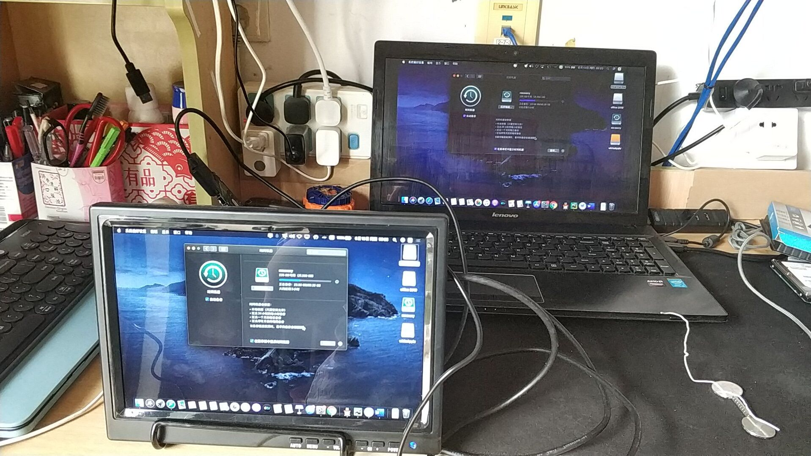
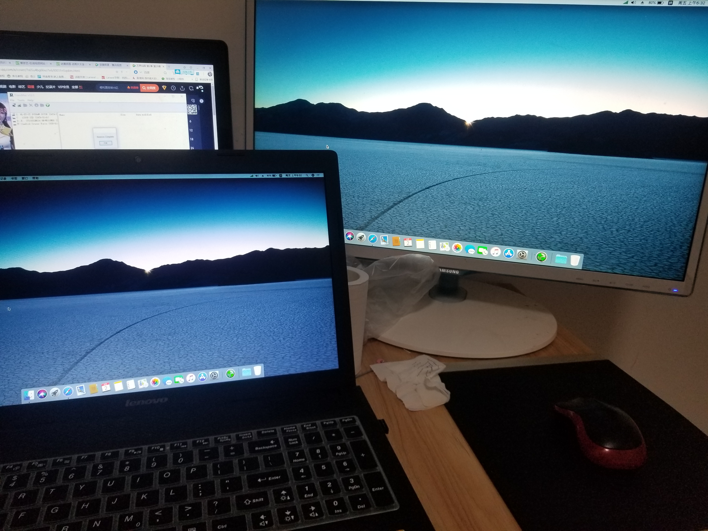

# 联想G410&G510安装macOS Catalina 10.15& macOS Mojave 10.14& High Sierra 10.13 使用说明

让你的G410&G510笔记本吃上黑苹果

[English](README-EN.md) | [中文](README.md)
 
 * | Computer:Lenovo G410&G510 Laptop
 * | CPU :Intel Core i5-4200M @ 2.50G/Intel Core i7-4700MQ @ 2.40G (Haswell )
 * | Chipset : Lenovo (Intel HM86 Chipset)
 * | Graphics :HD4600 (using Intel GPU only) 
 * | Audio:CX20757
 * | Ethernet:Atheros QCA8172 Gigabit Ethernet
 * | WiFi:AR9485
 * | Bluetooth:        
 
    
   

### 支持列表

* 支持macOS Catalina 10.15& macOS Mojave 10.14& High Sierra 10.13
* ACPI补丁修复使用hotpatch方式，相关文件位于 `/CLOVER/ACPI/patched` 。
* 远景论坛ID：39军小兵张 http://i.pcbeta.com/space-uid-4472739.html
* 安装视频教程及效果展示：https://space.bilibili.com/414418614/video
* 长期维护更新QQ群：686848381 群已改为收费群了，请为技术服务付费，享受后期免费维护更新。入群5-10元，如果需要远程技术指导安装，30以上你看着给吧。

## 发布

最后发布的版本前往 [release page](https://github.com/Z39/G510-OS-X-Clover-Hotpatch/releases) 下载即可。
如果Github网络下载不太好，新增[蓝奏云](https://www.lanzous.com/b616223)  密码：8shm

## 关于打赏

如果您认可我的工作，请通过打赏支持我后续的更新(自觉打赏的人真少啊，免费的东西长久不了,现已改为需要收费解压，需微信或支付宝打赏入群。打赏记得发备注你的qq号，然后申请入群时，说一下，我确认后会通过你的验证的。

|                                 微信                                           |                         支付宝                                       |
| ---------------------------------------------------------- | ---------------------------------------------------- |
|                                          |                            |

|                   大Y大G QQ群                                         |                拯救者QQ群                                       |
| ----------------------------------------------------------| ---------------------------------------------------- |
|                                    |                               |

## 黑苹果相关情况
- [x] 显卡 核显HD4600驱动 QE/CI AGPM
- [x]  USB 3.0 USB端口定制 
- [x]  亮度调节 F11/F12
- [x]  声卡 定制AppleALC
- [x]  CPU变频  
- [x]  电源电池睡眠唤醒（电源管理LPC ok，电池已修正能显示并更新剩余电量，开合盖唤醒/睡眠，关机重启正常断电）
- [x]  键盘 附件默认使用ApplePS2SmartTouchPad，兼容Synaptics和Elan
- [x]  触控板 
- [x] 有线网卡
- [x]  无线网卡 AR9485版有解
- [x]  蓝牙 需要更换
- [x]  摄像头
- [x]  App Store/iCloud/iMessage/Facetime
- [x]  SIP 关闭SIP
- [x]  TRIM 固态默认开启
- [x]  无痛更新升级 支持在线升级
- [x]  读卡器 未知
- [x] 外接显示器 HDMI视频/声音输出,VGA不支持
- [x]  自带独显屏蔽
- [x] 光驱，不过据景友反映光驱OK，刻录功能自测。

### 存在问题
* 1.FN箭头快捷待增加
   2.蓝牙自己搞定
   3.其他问题自测

